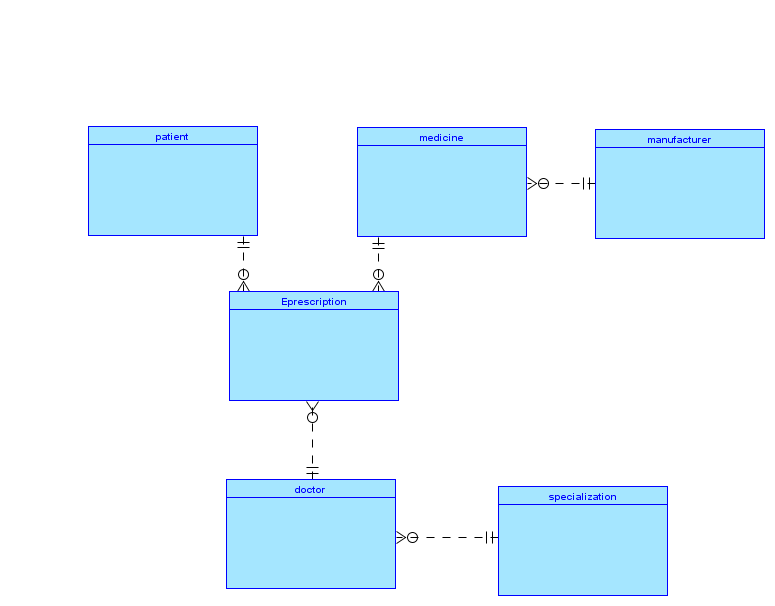
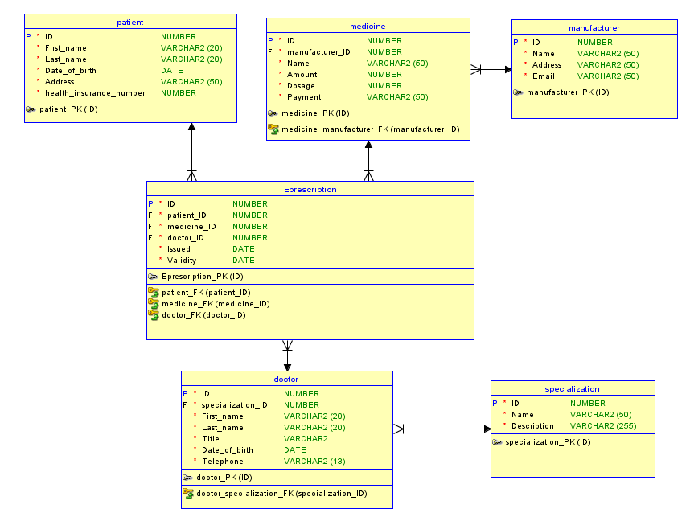

# Databázový systém
- **Název projektu**: Databázový systém na e-recept
- **Autor**: Jakub César
- **Email**: cesar@spsejecna.cz
- **LinkedIn**: [LinkedIn - Jakub César](https://tr.linkedin.com/in/jakub-c%C3%A9sar-714584243)
- **Github**: [Github - Jakub César](https://github.com/cesarjakub)
    - **Github odkaz na repozitář projektu**: [Github - repo](https://github.com/cesarjakub/alpha_3)
- **Datum vypracování**: 04.02.2024
- **Škola**: Střední průmyslová škola elektrotechnická, Praha 2, Ječná 30 
- **Projekt**: Jedná se o školní projekt

<hr>
nadpis 2 - 4
<hr>

## E-R diagram
- Logické schéma databáze

- Relační schéma databáze


<hr>
nadpis6
<hr>

## Nastavení config souboru
- Po [instalaci](#instalace-a-spuštění-aplikace) si otevřeme složku `Config/`
- Zde se nachází soubor `config.json`, který vypadá takto:
```json
{
  "database": {
    "server": "DESKTOP-2QAB4PC\\SQLEXPRESS",
    "DATABASE": "EPrescription",
    "UID": "test",
    "PWD": "1234"
  },
  "imports_path": {
    "path_json": "../Data/Import/patient.json"
  },
  "export_path": {
    "path": "../Data/Export/export"
  }
}
```
- První část obsahuje configuraci databáze tedy než pustíme aplikaci musíme nakonfigurovat databázi
    - **server**: název serveru zde je lokální je **třeba přepsat na svůj server** 
    - **DATABASE**: název databáze můžeme nechat 
    - **UID**: název uživatele (vytvoříme v databázi)
    - **PWD**: heslo pro uživatele (vytovoříme v databázi)

- Druhá část obsahuje cestu k souboru, který obsahuje importy do datbáze ve formátu json
    - **path_json**: přepíšeme pokud chceme importovat jiný **json** soubor **musí mít      správnou strukturu**

- Třetí část obsahuje cestu kam chceme aby se ukládal vzgenerovaný report s halvičkou a patičkou
    - **path**: přepíšeme pokud chceme soubory ukládat jinam

## Instalace a Spuštění aplikace
- **Instalace**
    - máme 2 možnosti: 
        1) stáhneme si zdrojový kód z githubu [odkaz víše](#databázový-systém) 
        2) stáhneme z moodle [moodle](https://moodle.spsejecna.cz/)
    
- **Spuštění bez vývojového prostředí**
    - Nejpreve si zkontrolujme jestli jsem nastavili vše správně v [config souboru](#nastavení-config-souboru)
    - Otevřete si v **cmd**(Příkazovým řádeku) složku *ALpha_3* a pomocí příkazu:
    ```commandline
    cd .\src\
    ```
    - si vlezeme do složky src kde spustíme příkaz 
    ```commandline
    python .\main.py
    ```
     - poté nám program běží

## Chybové stavy
- Chyba může nastat při pokusu připojení do databáze
  - Řešení:
    1) kontrola configu zda jsou informace správně napsané
- Ostatní chyby by měly být řešeny přímo v aplikaci tedy neměla by nastat žádná s kterou by si uživatel nevěděl rady

## Knihovy třetích stran
- knihovny:
    - **json** knihovna
    - **sys** knihovna
    - **pyodbc** knivovna
    - **uuid** knihovna
    - **datetime** knivovna
    - **os** knihovna

## Závěr 